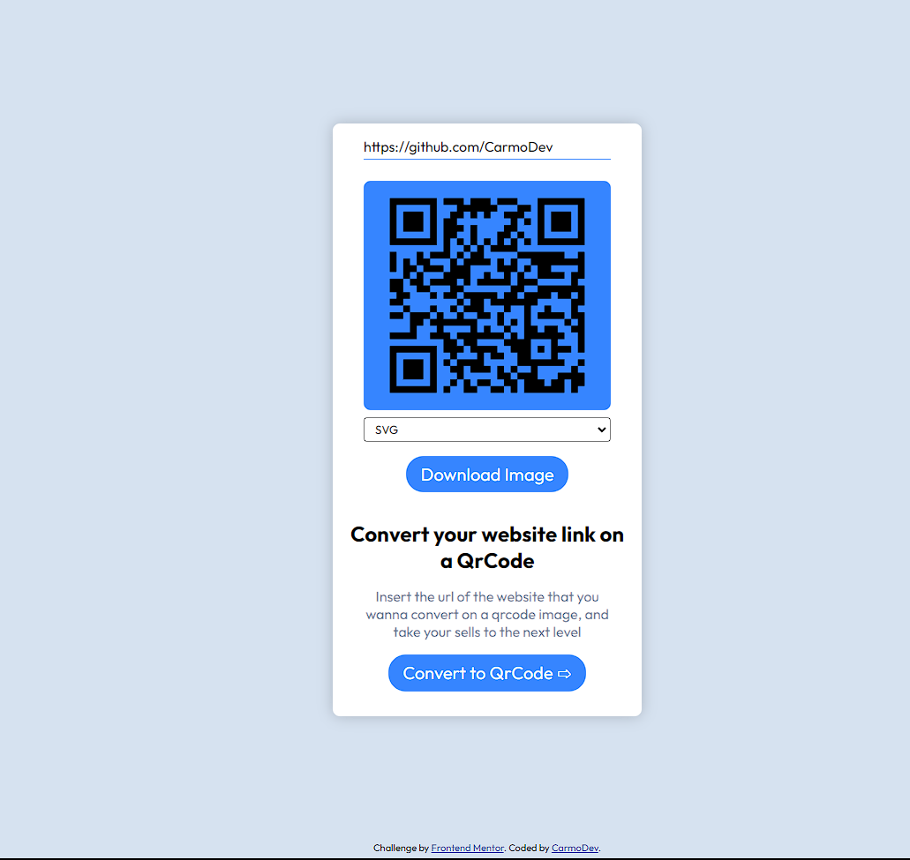

# Frontend Mentor - QR code component solution

This is a solution to the [QR code component challenge on Frontend Mentor](https://www.frontendmentor.io/challenges/qr-code-component-iux_sIO_H). 

## Table of contents

- [Overview](#overview)
  - [Screenshot](#screenshot)
  - [Links](#links)
- [My process](#my-process)
  - [Built with](#built-with)
  - [Main Parts](#main-parts)
  - [Continued development](#continued-development)
- [Author](#author)


## Overview

### Screenshot



### Links

- Solution URL: [Frontend Mentor](https://www.frontendmentor.io/solutions/responsive-url-to-qrcode-conversor-with-flexbox-n47vxdutsL)
- Live Site URL: [CreateQrCode](https://url-to-qrcode.vercel.app/)

## My process

### Built with

- Semantic HTML5 markup
- CSS custom properties
- Flexbox
- Mobile-first workflow
- VanillaJs


### Main parts

These are the most importants parts of the code, they keeps everything on the track:

```css
.invisible {
  display: none;
}
```

```js
function convertUrlToQrCode(event) {
    urlInput.disabled = true;
    convert.disabled = true;
    event.preventDefault();

    const url = urlInput.value;
    const format = formatInput.value

    fetch(`https://power-tan-sherbet.glitch.me/qr?url=${url}&format=${format}`)
      .then((response) => response.blob())
      .then((blob) => {
        let urlImage = URL.createObjectURL(blob);
        qrCodeImg.src = urlImage;

        qrCodeImg.onload = () => {
          urlInput.disabled = false
          downloadImage(urlImage);
          downloadBtn.classList.remove("invisible");
        };
      })
      .then(
        qrCodeImg.classList.remove("invisible"),
        qrCodeImg.classList.add("qrCode"),
      )
      .catch((err) => console.error("Failed to convert url on QrCode:", err))
      .finally(
        urlInput.disabled = false,
        convert.disabled = false
      )
  }
```

### Continued development
On the future I would like to add the function to implements an logo on the middle of the QrCode

## Author

- Website - [Portfolio](https://carmodev.vercel.app/)
- Frontend Mentor - [@carmoDev](https://www.frontendmentor.io/profile/CarmoDev)
- Linkedin - [@carmoDev](https://www.linkedin.com/in/carmodev/)

